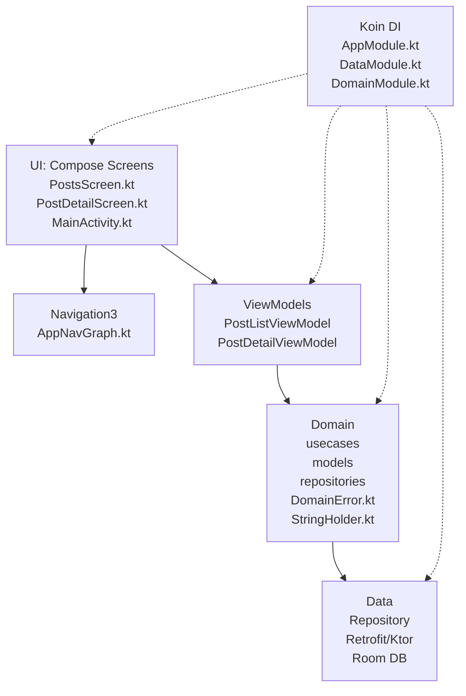
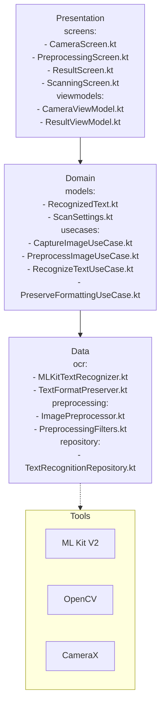

# Анализ проекта MLScanner

## Текущая структура проекта

Проект - Android приложение на **Kotlin** с **Jetpack Compose**, **Koin DI**, **Room DB**, **Retrofit/Ktor**, **Navigation 3**, **Paging 3**. Это шаблонный проект для списка постов (PostsScreen -> PostDetailScreen) с навигацией.

### Ключевые файлы и зависимости ([`app/build.gradle.kts`](app/build.gradle.kts))
- ✅ Уже добавлены **ML Kit Text Recognition V2**, **Language ID**, **CameraX**, **OpenCV 4.9.0** (из README).
- Архитектура: MVVM + Clean (data/domain/ui), но сейчас demo с постами из API.
- minSdk=24, targetSdk=36, Compose BOM 2024.11.00.

### Текущая архитектура (Mermaid)


## Предложенная архитектура из README (Clean + MVVM для OCR)

### Целевая структура (Mermaid)


## Сравнение и пробелы
| Аспект | Текущее | Целевое (README) | Статус |
|--------|---------|------------------|--------|
| **Зависимости** | ✅ ML Kit, CameraX, OpenCV добавлены | Полный стек | Готово |
| **Экраны** | PostsScreen, PostDetailScreen | Camera, Preprocessing, Result, Scanning | ❌ Отсутствуют |
| **Domain** | Посты модели/usecases | RecognizedText, ScanSettings, OCR usecases | ❌ Отсутствуют |
| **Data** | API + Room для постов | OCR repo, ImagePreprocessor, TextFormatPreserver | ❌ Отсутствуют |
| **Навигация** | ✅ Navigation3 + BackStack | Нужны новые routes | Частично |
| **DI** | ✅ Koin modules | Добавить OCR modules | Нужно |
| **Permissions** | INTERNET | CAMERA, STORAGE | ❌ Добавить CAMERA |
| **Размер APK** | ~? | 50-80 MB | Проверить |

**Пробелы**: Нет OCR логики, камеры, предобработки. Текущий код - demo постов (JSONPlaceholder?).

## План реализации MVP (Фазы из README)

### Фаза 1: Базовый прототип (1-2 дня)
1. Заменить MainActivity на минимальный тест OCR ([`MainActivity.kt`](app/src/main/java/com/arny/mlscanner/ui/MainActivity.kt:616)).
2. Создать RecognizedText.kt, ScanSettings.kt.
3. Реализовать RecognizeTextUseCase.kt + TextFormatPreserver.kt.
4. Тест на bitmap из resources.

### Фаза 2: Форматирование (1 день)
1. Интегрировать TextFormatPreserver.

### Фаза 3: Предобработка (2-3 дня)
1. ImagePreprocessor.kt с OpenCV.
2. Настройки в UI.

**Полный todo для code mode:**
```
[ ] Фаза1: Создать domain/models/RecognizedText.kt, ScanSettings.kt
[ ] Фаза1: data/ocr/TextFormatPreserver.kt
[ ] Фаза1: domain/usecases/RecognizeTextUseCase.kt
[ ] Фаза1: Тест в MainActivity.kt
[ ] Фаза2: Интеграция форматирования
[ ] Фаза3: data/preprocessing/ImagePreprocessor.kt
[ ] Добавить CAMERA permission в AndroidManifest.xml
[ ] Создать presentation/screens/ResultScreen.kt
[ ] Обновить навигацию для OCR screens
[ ] DI: Добавить modules для OCR
```

Одобряете план? Готовы switch to code mode?